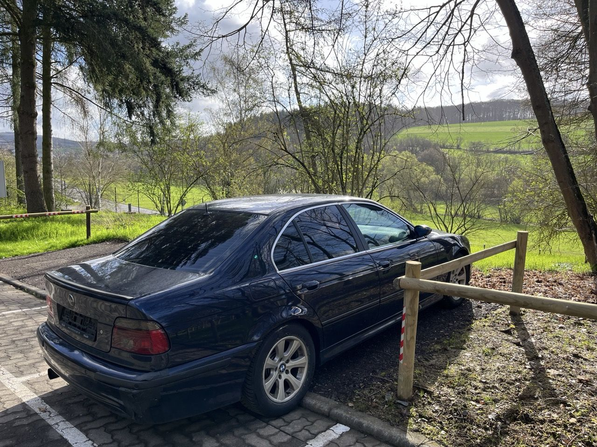

## Außen

[zurück](../)

## Außen abends

[zurück](../)

## Cockpit

[zurück](../)

## Innenraum

[zurück](../)

## Kofferraum

[zurück](../)

## Schlüssel

[zurück](../)

<!--

-->

## Motor

[zurück](../)

## Reifen/Felgen

[zurück](../)

